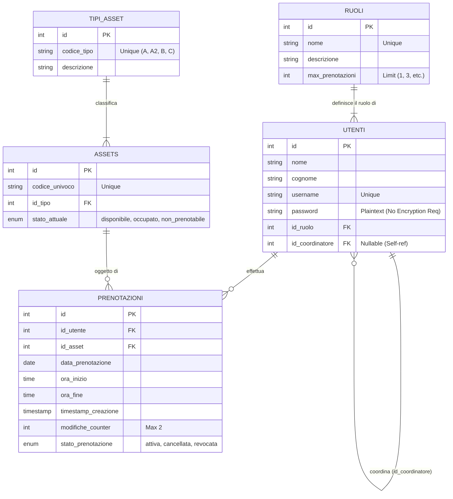

# Z-Volta Asset Management

## Descrizione Progetto
L’azienda **Z-Volta** opera nel settore terziario e necessita di una soluzione software per la gestione della nuova sede in modalità "smartworking". Il sistema permette la gestione di asset aziendali (scrivanie, sale meeting, parcheggi) e la loro prenotazione da parte del personale.

### Profili Utente
*   **Gestore (Admin):** Gestione completa di utenti e asset, visibilità totale.
*   **Coordinatore:** Prenota per sé (fino a 3 asset) e visualizza le prenotazioni del proprio team.
*   **Dipendente:** Prenota asset (1 max) di tipo scrivania o sala riunioni.

### Asset Gestiti
1.  **Tipo A:** Scrivania base (Scrivania + Cassettiera + Armadietto)
2.  **Tipo A2:** Scrivania attrezzata (+ Monitor)
3.  **Tipo B:** Sala Riunioni
4.  **Tipo C:** Posto Auto

## Diagramma ER (Entity-Relationship)

Il seguente diagramma illustra la struttura del database progettato nel file `database.sql`.

## Note Tecniche
*   **Sicurezza Password:** Come da requisiti, la password è salvata senza crittografia (o hash semplice), ma l'applicazione implementa controlli di complessità (8 caratteri, mixed case, numeri, simboli).
*   **Captcha:** L'autenticazione prevede un Captcha generato algoritmicamente.
*   **Mappe:** Gli asset sono identificati da un `codice_univoco` che corrisponde alla loro posizione sulla mappa visuale nel frontend.
